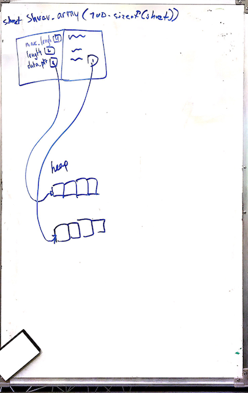
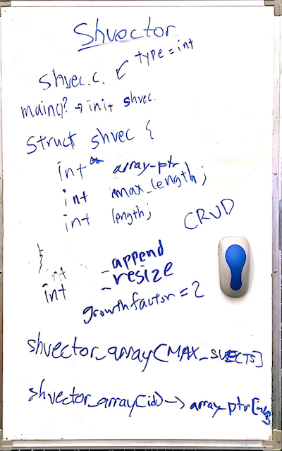

# Meeting Notes

## 2/24:
### Agenda:
- Make API and block diagram of dalloc
- What will be our pull request process?
  - Peer programming + 3rd reviewer?
  - [x] Independent implementations + 2 peer reviewers?
  - Anything goes just merge it in?
- Create kanban cards and assign them
- How to continually write `update.md`?

### Meeting:
#### Made api
Written up in spec.md

#### Pull requests workflow
One reviewer to merge in, everyone is expected to read all pull requests.

#### Implementation
For first pass, we will use an array to keep track of ids.
  - Make this dynamically long





##### Stretch goals:
Prepend values: (allocating empty space before the array and boundry checking both ways)

##### Arbitrary types:
  - Passing in type with an enum on `_create`
  - Internally values are a void*
  - Can we cast it back and return a type value with one function?

```
typedef enum {
    CHAR,
    INT,
    FLOAT,
    DOUBLE
} TYPE;

void foo(TYPE t, void* x){
    switch(t){
        case CHAR:
            (char*)x;
            break;
        case INT:
            (int*)x;
            break;
         ...
    }
}
```


### Questions:
- How to implement ids?
- How to implement arbitrary types?
- What is the optimal multiple of reallocated size?
  - Python uses 1.125
  - Java uses 1.5
  - C++ uses 2
  - Naive implementation is 2

### Next Meeting (3/1):
- Plan to polish `update.md` (continually?)
- Expand scope of project
